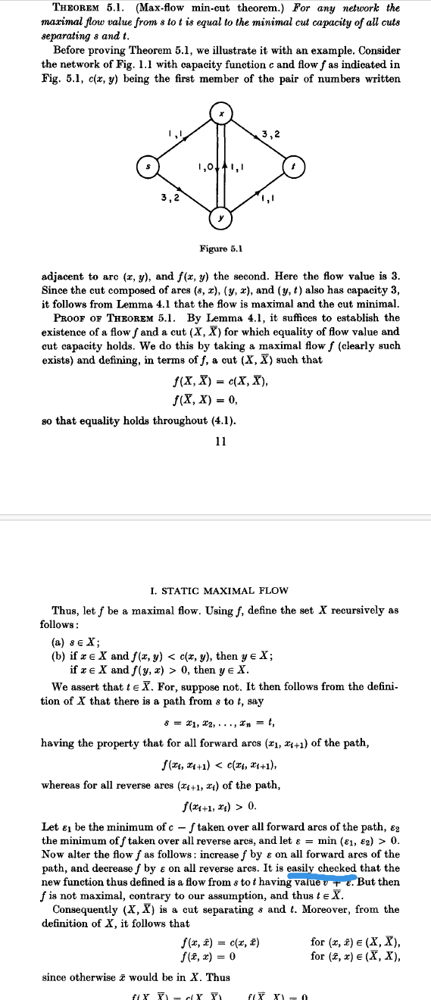
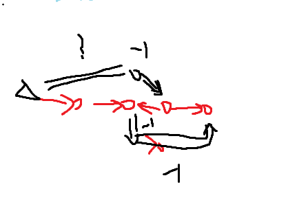

## Network Flows
我先前无法理解最小割最大流定理的证明。根据 Flows in Networks 的 Lemma 5.1 等。今天读懂了，作此记录。

Thereom 5.1 是基于 Lemma 4.1 得出。

### Lemma 4.1
在 Lemma 4.1 中有结论，令割为 $X, \bar{X}$。

$$f(X,\bar{X}) - f(\bar{X},X) = v$$

notations 在书中已有介绍。证明是通过 flow 本身的定义（2.1）推导出的。

> 直观一点的解释为：
> 对于每一个单位流来说，如果有从一条边流向了 $\bar{X}$，其要么通过某种方式流回 $X$，要么不流回 $X$ 直接流向 sink $t$。
>
> 倘若其流回了 $X$。这个单位的流（总归是要流向 $t$ 的）一定在某一时刻又流向了 $\bar{X}$ 一次。被重复计数了。因此最终流向 $t$ 的流要减去 $f(\bar{X},X)$。

### Thereom 5.1
- path 不是 sequence
- 这里所有的都是有向边，不存在我们平时说的建反边。整个网络流问题都是有向边！
- 下图蓝线的 `easily checked` 有些晦涩。 
  

如下图图示：

如果存在有流量反边(x,y)。则其一定有从 s 流入的 sequence，且从某个 path 以外的边流出。这个 sequence 的 flow > 0。这是真的。
我们将(x,y)所在的 sequence 的 flow - 1。此时我们惊喜的发现，y 出发至 t 有一个 sequence，且这个 sequence 刚才被 -1 了。没有流满。 然而根据定义 (s,x) 的 sequence也没有流满。此时我们就可以对整个 sequence + 1 flow。 那么我们的流量就多了 1.

