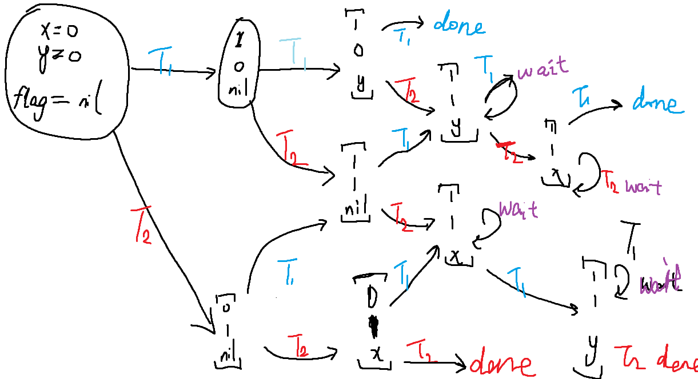

# Where is nju-3?
偷懒了

# Quiz
## 1. 如何保证原子性？
> crux: 计算机做不到 LOAD&STORE 的原子
### 失败例：
    github.com/proc-moe/OS-lab/tree/main/thread/atomic
    $ sh bad_try
    简而言之，两个人同时取钱，同时看到了账户里有余额，钱同时没了。

原因？

计算机无法保证两条指令是同一原子性的。

t1 和 t2 同时到达 if 语句， 执行顺序 t1 -> t2 。此时 t1, t2 都成功从l3 -> l7, 并可以加锁。


``` c
void atomic_add(int sum){
retry:
    if (locked != UNLOCK){
        goto retry;   
    }

    lock = locked;
    // critical section
    lock = unlocked;
}
```

### 正确(?)的互斥协议
#### Peterson 算法
```
A 和 B 争用厕所的包厢

想进入包厢之前，A/B 都要先举起自己的旗子
A 确认旗子举好以后，往厕所门上贴上 “B 正在使用” 的标签
B 确认旗子举好以后，往厕所门上贴上 “A 正在使用” 的标签
然后，如果对方的旗子举起来，且门上的名字不是自己，等待
否则可以进入包厢
出包厢后，放下自己的旗子
```

详见教学视频，这里是两人分别举旗+贴纸+观察。

好吧，这里有6步，我用我可怜的高中水平的数学素养算出，这里一共有C(3,6)= 20 种可能。


**真吗？**

万恶的分类讨论：

一人举旗：

（比如 A 举旗） B 肯定什么也没有干。 done

两人同时举旗了：

谁贴的早谁进去，因为看到自己名字的可以进去。

如果 A 看见 B 举旗：

编不出来了

**丁真吗？**

Brute force:



真（内存真的被写了的情况）

## 2. 如何自动化验证互斥
model-checker.py